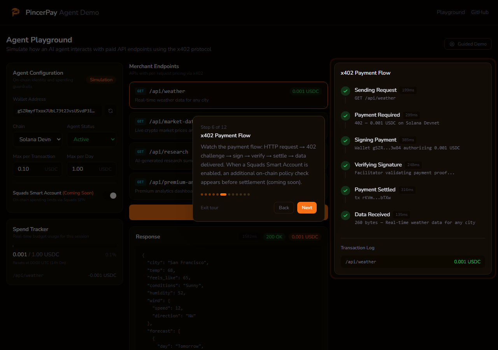

# PincerPay

The payment gateway for the agentic economy. Accept payments from AI agents. Add a few lines of code. Settle instantly in USDC.

## Architecture

```
Agent → 402 Challenge → Sign USDC Transfer → PincerPay Facilitator → Blockchain → Merchant
```



PincerPay is a non-custodial x402 facilitator. When an AI agent hits a merchant API and gets HTTP 402, the agent signs a USDC transfer. PincerPay verifies the signature, broadcasts to the blockchain, and confirms settlement.

## Monorepo Structure

| Package | Description | Docs |
|---|---|---|
| `apps/facilitator` | x402 facilitator service (Hono + Node.js) | |
| `apps/dashboard` | Merchant dashboard (Next.js 15) | |
| [`packages/merchant`](packages/merchant/) | Merchant SDK — Express + Hono middleware | [README](packages/merchant/README.md) |
| [`packages/agent`](packages/agent/) | Agent SDK — automatic x402 payment handling | [README](packages/agent/README.md) |
| [`packages/core`](packages/core/) | Shared types, chain configs, constants | [README](packages/core/README.md) |
| [`packages/db`](packages/db/) | Drizzle ORM schema + migrations | [README](packages/db/README.md) |
| [`packages/program`](packages/program/) | Anchor program client for Solana | [README](packages/program/README.md) |
| [`packages/solana`](packages/solana/) | Kora gasless txns + Squads smart accounts | [README](packages/solana/README.md) |
| [`packages/onboarding`](packages/onboarding/) | Non-custodial wallet generation + merchant bootstrap | [README](packages/onboarding/README.md) |
| [`packages/cli`](packages/cli/) | Terminal-only merchant onboarding (`npx @pincerpay/cli`) | [README](packages/cli/README.md) |
| [`packages/mcp`](packages/mcp/) | MCP server for AI assistants (26 tools) | [README](packages/mcp/README.md) |
| `examples/` | Example merchant and agent apps | |

## Quick Start

### Prerequisites

- Node.js 22+
- pnpm 10+
- PostgreSQL (Supabase recommended)

### Install

```bash
pnpm install
```

### Build

```bash
pnpm build
```

### Development

```bash
# Start all services
pnpm dev

# Start individual services
pnpm --filter @pincerpay/facilitator dev
pnpm --filter @pincerpay/dashboard dev
```

### Database

```bash
# Generate migrations from schema
pnpm db:generate

# Push schema to database
pnpm db:push
```

### Onboarding scripts

Provision a merchant from the command line — no dashboard click-through.

```bash
# Generate non-custodial wallets only (no DB)
pnpm create-wallets

# End-to-end: generate wallets, create merchant, mint API key
DATABASE_URL=postgresql://... pnpm bootstrap-merchant \
  --name "My Merchant" --auth-user-id <supabase-uuid>

# Mint a key for an existing merchant
DATABASE_URL=postgresql://... pnpm create-api-key list
DATABASE_URL=postgresql://... pnpm create-api-key create --merchant <id|name> --label "Production"
```

The same flows are exposed as MCP tools (`bootstrap-wallets`, `bootstrap-merchant`, `create-api-key`, `list-merchants`) in `@pincerpay/mcp`. See [Merchant Onboarding](https://pincerpay.com/docs/onboarding).

## Merchant SDK

```typescript
import express from "express";
import { pincerpay } from "@pincerpay/merchant/express";

const app = express();

app.use(
  pincerpay({
    apiKey: process.env.PINCERPAY_API_KEY!,
    merchantAddress: "YOUR_SOLANA_ADDRESS",
    routes: {
      "GET /api/weather": {
        price: "0.01",
        chain: "solana",
        description: "Weather data",
      },
    },
  })
);
```

See [`@pincerpay/merchant` README](packages/merchant/README.md) for Hono middleware, multi-chain config, and full API reference.

## Agent SDK

```typescript
import { PincerPayAgent } from "@pincerpay/agent";

const agent = await PincerPayAgent.create({
  chains: ["solana"],
  solanaPrivateKey: process.env.AGENT_SOLANA_KEY!,
});

// Automatic 402 handling
const response = await agent.fetch("https://api.example.com/weather");
```

See [`@pincerpay/agent` README](packages/agent/README.md) for spending policies, multi-chain setup, and Squads smart accounts.

## Supported Chains

| Chain | Network ID | Status |
|---|---|---|
| Base | eip155:8453 | Mainnet |
| Base Sepolia | eip155:84532 | Testnet |
| Polygon | eip155:137 | Mainnet |
| Polygon Amoy | eip155:80002 | Testnet |
| Solana | solana:mainnet | Supported |
| Solana Devnet | solana:devnet | Testnet |

## Deployment

| Service | URL |
|---|---|
| Facilitator | `https://pincerpayfacilitator-production.up.railway.app` |
| Dashboard | `https://pincerpay.com` |

The facilitator is deployed to Railway via Docker. The dashboard is deployed to Vercel. Solana is the primary chain (devnet). Base and Polygon are supported as optional secondary chains.

## Tech Stack

- **Runtime:** Node.js 22 (pnpm monorepo + Turborepo)
- **Facilitator:** Hono + @x402/core + @x402/evm + @x402/svm + viem
- **Dashboard:** Next.js 15 + Tailwind CSS + Supabase Auth
- **Database:** PostgreSQL (Supabase) + Drizzle ORM
- **CI:** GitHub Actions (typecheck → test → build)
- **Protocols:** x402 (Coinbase)

## Testing

```bash
pnpm test
```

47 tests across 5 suites (core, agent, merchant, facilitator).

## Examples

| Example | Description |
|---|---|
| [`examples/express-merchant`](examples/express-merchant/) | Express merchant with PincerPay middleware |
| [`examples/agent-weather`](examples/agent-weather/) | AI agent paying for weather API data |
| [`pincerpay-agent-demo`](https://github.com/ds1/pincerpay-agent-demo) | Standalone agent demo repository |

## Community

- [Discord](https://discord.gg/sZkYQTqT23)
- [@pincerpay on X](https://x.com/pincerpay)

## License

MIT
